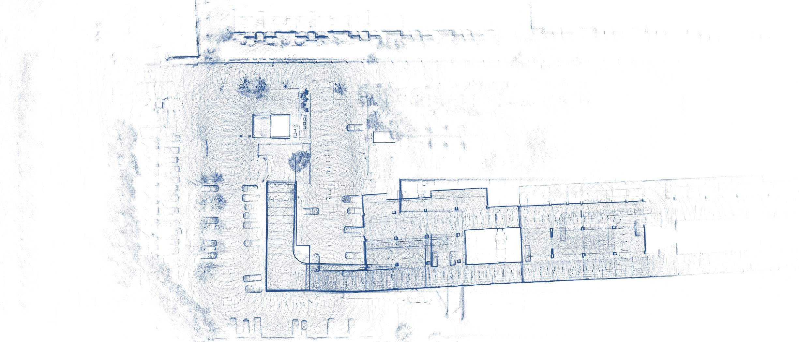

# auto_driving_localization_new

深蓝学院线下《自动驾驶多传感器融合定位实战》[课程](https://www.shenlanxueyuan.com/course/559)代码的ROS版本，是线上《多传感器融合定位》[课程](https://www.shenlanxueyuan.com/course/558)代码的迭代版本，优化了激光雷达+GNSS+IMU+轮速计的融合模式，目前仍处于开发阶段:smile:


原始版本：



迭代版本：


基于先验地图的定位:

## 编译方式

```bash
# 编译建图模块
catkin_make --cmake-args -DBUILD_MAPPING=ON
# 使用滤波器定位
catkin_make --cmake-args -DBUILD_MAPPING=OFF -DUSE_KALMAN=ON
# 使用优化器定位
catkin_make --cmake-args -DBUILD_MAPPING=OFF -DUSE_KALMAN=OFF
```

## 环境要求

- g++ & gcc >= 7.0
- ROS melodic
- Eigen3
- Ceres >= 2.0.0
- g2o 


## 运行方式

### 基于kitti数据集的建图

```bash
# 配置lio_back_end.yaml，使能需要的约束和其对应的权重
# 请不要使用imu约束和里程计约束（重点）

#  启动节点
source devel/setup.bash
roslaunch lidar_localization lio_mapping.launch

# 播放数据集

# 优化轨迹（多执行几次）
source devel/setup.bash
rosservice call /optimize_map

# 保存地图
rosservice call /save_map

# 保存gnss原点（方便定位使用）
rosservice call /save_origin
```

### 基于urbanNav数据集的建图

urbanNav数据集[下载地址](https://github.com/weisongwen/UrbanNavDataset)，目前仅支持：

1. UrbanNav-HK-Data20190428
2. UrbanNav-HK-Data20200314

```bash
# 配置hk_data_pretreat.yaml，设置外参

# 配置hk_lio_back_end.yaml，使能需要的约束和其对应的权重
# 请不要使用imu约束和里程计约束（重点）

#  启动节点
source devel/setup.bash
roslaunch lidar_localization hk_lio_mapping.launch

# 播放数据集

# 优化轨迹（多执行几次）
source devel/setup.bash
rosservice call /optimize_map

# 保存地图
rosservice call /save_map
```

### 基于深蓝数据集的建图

```bash
# 配置shenlan_data_pretreat.yaml，设置外参

# 配置loop_closing, 将loop_step从5改成2, 将diff_num从100改成10

# 配置shenlan_lio_back_end.yaml，使能需要的约束和其对应的权重
# 可以使用imu约束和里程计约束（重点）

#  启动节点
source devel/setup.bash
roslaunch lidar_localization shenlan_lio_mapping.launch

# 播放数据集

# 优化轨迹（多执行几次）
source devel/setup.bash
rosservice call /optimize_map

# 保存地图
rosservice call /save_map

# 保存gnss原点（方便定位使用）
rosservice call /save_origin
```


### 基于仿真数据的建图

```bash
# 配置simulator.yaml，设置仿真数据噪声大小

# 配置lio_back_end_sim.yaml，使能需要的约束和其对应的权重

#  启动节点
source devel/setup.bash
roslaunch lidar_localization lio_mapping.launch

# ctrl+c退出，轨迹会自动保存
```

### 基于kitti数据集的滤波定位

```bash
# 配置kitti_filtering.ymal，配置地图加载路径、定位方式、滤波器权重

#  启动节点
source devel/setup.bash
roslaunch lidar_localization lio_mapping.launch

# 播放数据集

# 保存轨迹
source devel/setup.bash
rosservice call /save_odometry
```
### 基于仿真数据的滤波定位

```bash
# 配置gnss_ins_sim_filtering.ymal，配置定位方式、滤波器权重

#  启动节点
source devel/setup.bash
roslaunch lidar_localization gnss_ins_sim_localization.launch

# 播放数据集

# 保存轨迹
source devel/setup.bash
rosservice call /save_odometry
```

### 基于深蓝数据集的滤波定位

由于数据集gnss坐标系原因, 目前仅支持手动输入初始位置完成重定位初始化

```bash
# 配置shenlan_data_pretreat.yaml, 不同的小车外参不同

# 配置shenlan_filtering.yaml, 重点设置guess_pos这个参数, 不然会初始化不成功

#  启动节点
source devel/setup.bash
roslaunch lidar_localization shenlan_filtering_localization.launch

# 播放数据集

# 暂不支持保存轨迹, 因为gnss坐标系的原因, 就算保存了融合轨迹与gnss轨迹也差个十万八千米远
```

### 基于kitti数据集的优化定位

目前只支持地图匹配+imu预积分的融合

```bash
# 配置sliding_window.ymal，配置地图加载路径、使能需要的约束和其对应的权重

#  启动节点
source devel/setup.bash
roslaunch lidar_localization lio_localization.launch

# 播放数据集

# 保存轨迹
source devel/setup.bash
rosservice call /save_odometry
```
### 基于深蓝数据集的优化定位

目前只支持地图匹配+imu预积分的融合

```bash
# 配置shenlan_data_pretreat.yaml, 不同的小车外参不同

# 配置shenlan_matching.yaml, 重点设置guess_pos这个参数, 不然会初始化不成功

# 配置shenlan_sliding_window.ymal，配置地图加载路径、使能需要的约束和其对应的权重

#  启动节点
source devel/setup.bash
roslaunch lidar_localization shenlan_lio_localization.launch

# 播放数据集
```

## 建图效果

UrbanNav-HK-Data20190428
